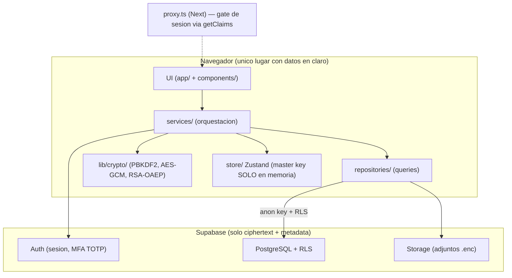
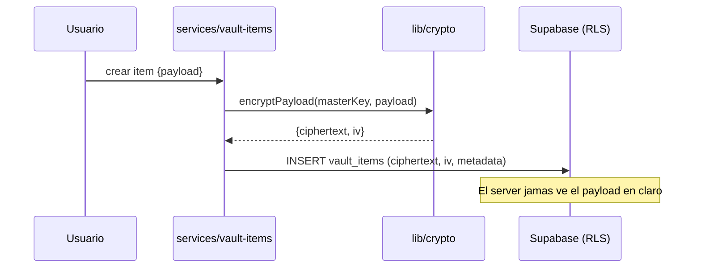
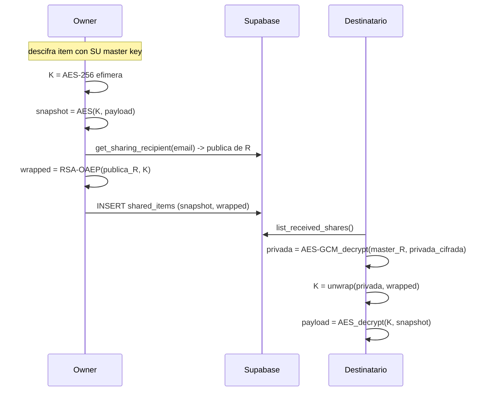
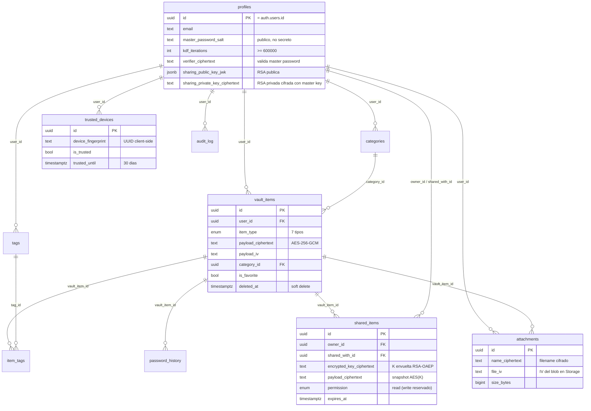

# Arquitectura

## Vista general

Reglas duras:

- La UI **nunca** importa `lib/crypto/` ni el cliente Supabase — siempre via `services/`.
- `lib/crypto/` es puro: sin red, sin estado, 100% testeable (Vitest, 100+ tests).
- La master key vive solo en Zustand (memoria volátil). Auto-lock la limpia.

## Flujo de datos de un item

## Compartir E2E

## ERD

Todas las tablas con datos de usuario tienen **RLS own-only** (políticas comentadas en `supabase/migrations/`). Los joins que cruzan usuarios (emails en shares) van por RPCs `SECURITY DEFINER` que exponen lo mínimo.
